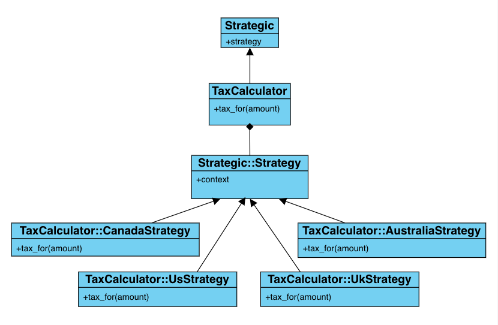

# Strategic 1.1.0
## Painless Strategy Pattern in Ruby and Rails
[](http://badge.fury.io/rb/strategic)
[](https://github.com/AndyObtiva/strategic/actions/workflows/ruby.yml)
[](https://coveralls.io/github/AndyObtiva/strategic?branch=master)
[](https://codeclimate.com/github/AndyObtiva/strategic/maintainability)

`if`/`case` conditionals can get really hairy in highly sophisticated business domains.
Object-oriented inheritance helps remedy the problem, but dumping all
logic variations in domain model subclasses can cause a maintenance nightmare.
Thankfully, the Strategy Pattern as per the [Gang of Four book](https://www.amazon.com/Design-Patterns-Elements-Reusable-Object-Oriented/dp/0201633612) solves the problem by externalizing logic via composition to separate classes outside the domain models.

Still, there are a number of challenges with "repeated implementation" of the Strategy Pattern:
- Making domain models aware of newly added strategies without touching their
code (Open/Closed Principle).
- Fetching the right strategy without the use of conditionals.
- Avoiding duplication of strategy dispatch code for multiple domain models
- Have strategies mirror an existing domain model inheritance hierarchy

`strategic` solves these problems by offering:
- Strategy Pattern support through a Ruby mixin and strategy path/name convention
- Automatic discovery of strategies based on path/name convention
- Ability to fetch needed strategy without use of conditionals
- Ability to fetch a strategy by name or by object type to mirror
- Plain Ruby and Ruby on Rails support

`Strategic` enables you to make any existing domain model "strategic",
externalizing all logic concerning algorithmic variations into separate strategy
classes that are easy to find, maintain and extend while honoring the Open/Closed Principle and avoiding conditionals.

In summary, if you make a class called `TaxCalculator` strategic by including the `Strategic` mixin module, now you are able to drop strategies under the `tax_calculator` directory sitting next to the class (e.g. `tax_calculator/us_strategy.rb`, `tax_calculator/canada_strategy.rb`) while gaining extra [API](#api) methods to grab strategy names to present in a user interface (`.strategy_names`), set a strategy (`#strategy=(strategy_name)`), and/or instantiate `TaxCalculator` directly with a strategy from the get-go (`.new_with_strategy(strategy_name, *initialize_args)`). Finally, you can simply invoke strategy methods on the main strategic model (e.g. `tax_calculator.tax_for(39.78)`).

### Example



1. Include `Strategic` module in the Class to strategize: `TaxCalculator`

```ruby
class TaxCalculator
  include Strategic

  # strategies may implement a tax_for(amount) method
end
```

2. Now, you can add strategies under this directory without having to modify the original class: `tax_calculator`

3. Add strategy classes having names ending with `Strategy` by convention (e.g. `UsStrategy`) under the namespace matching the original class name (`TaxCalculator::` as in `tax_calculator/us_strategy.rb` representing `TaxCalculator::UsStrategy`) and including the module (`Strategic::Strategy`):

All strategies get access to their context (strategic model instance), which they can use in their logic.

```ruby
class TaxCalculator::UsStrategy
  include Strategic::Strategy
  
  def tax_for(amount)
    amount * state_rate(context.state)
  end
  # ... other strategy methods follow
end

class TaxCalculator::CanadaStrategy
  include Strategic::Strategy

  def tax_for(amount)
    amount * (gst(context.province) + qst(context.province))
  end
  # ... other strategy methods follow
end
```

(note: if you use strategy inheritance hierarchies, make sure to have strategy base classes end with `StrategyBase` to avoid getting picked up as strategies)

4. In client code, set the strategy by underscored string reference minus the word strategy (e.g. UsStrategy becomes simply 'us'):

```ruby
tax_calculator = TaxCalculator.new(args)
tax_calculator.strategy = 'us'
```

4a. Alternatively, instantiate the strategic model with a strategy to begin with:

```ruby
tax_calculator = TaxCalculator.new_with_strategy('us', args)
```

5. Invoke the strategy implemented method:

```ruby
tax = tax_calculator.tax_for(39.78)
```

Default strategy for a strategy name that has no strategy class is `nil`

You may set a default strategy on a strategic model via class method `default_strategy`

```ruby
class TaxCalculator
  include Strategic
  
  default_strategy 'canada'
end

tax_calculator = TaxCalculator.new(args)
tax = tax_calculator.tax_for(39.78)
```

If no strategy is selected and you try to invoke a method that belongs to strategies, Ruby raises an amended method missing error informing you that no strategy is set to handle the method (in case it was a strategy method).

## Setup

### Option 1: Bundler

Add the following to bundler's `Gemfile`.

```ruby
gem 'strategic', '~> 1.1.0'
```

### Option 2: Manual

Or manually install and require library.

```bash
gem install strategic -v1.1.0
```

```ruby
require 'strategic'
```

### Usage

Steps:
1. Have the original class you'd like to strategize include `Strategic` (e.g. `def TaxCalculator; include Strategic; end`
2. Create a directory matching the class underscored file name minus the '.rb' extension (e.g. `tax_calculator/`)
3. Create a strategy class under that directory (e.g. `tax_calculator/us_strategy.rb`), which:
 - Lives under the original class namespace
 - Includes the `Strategic::Strategy` module
 - Has a class name that ends with `Strategy` suffix (e.g. `NewCustomerStrategy`)
4. Set strategy on strategic model using `strategy=` attribute writer method or instantiate with `new_with_strategy` class method, which takes a strategy name string (any case), strategy class, or mirror object (having a class matching strategy name minus the word `Strategy`) (note: you can call `::strategy_names` class method to obtain available strategy names or `::stratgies` to obtain available strategy classes)
6. Invoke strategy method needed

## API

### Strategic model

#### Class Body Methods

These methods can be delcared in a strategic model class body.

- `::default_strategy`: sets default strategy as a strategy name string (e.g. 'us' selects UsStrategy) or alternatively a class/object if you have a mirror hierarchy for the strategy hierarchy
- `::strategy_matcher`: custom matcher for all strategies (e.g. `strategy_matcher {|string| string.start_with?('C') && string.end_with?('o')}`)

#### Class Methods

- `::strategy_names`: returns list of strategy names (strings) discovered by convention (nested under a namespace matching the superclass name)
- `::strategies`: returns list of strategies discovered by convention (nested under a namespace matching the superclass name)
- `::new_with_strategy(string_or_class_or_object, *args, &block)`: instantiates a strategy based on a string/class/object and strategy constructor args
- `::strategy_class_for(string_or_class_or_object)`: selects a strategy class based on a string (e.g. 'us' selects UsStrategy) or alternatively a class/object if you have a mirror hierarchy for the strategy hierarchy

#### Instance Methods

- `#strategy=`: sets strategy
- `#strategy`: returns current strategy

### Strategy

#### Class Body Methods

- `::strategy_matcher`: custom matcher for a specific strategy (e.g. `strategy_matcher {|string| string.start_with?('C') && string.end_with?('o')}`)
- `::strategy_exclusion`: exclusion from custom matcher (e.g. `strategy_exclusion 'Cio'`)
- `::strategy_alias`: alias for strategy in addition to strategy's name derived from class name by convention (e.g. `strategy_alias 'USA'` for `UsStrategy`)

#### Class Methods

- `::strategy_name`: returns parsed strategy name of current strategy class

#### Instance Methods

- `#context`: returns strategy context (the strategic model instance)

### Example with Customizations via Class Body Methods

```ruby
class TaxCalculator
  default_strategy 'us'

  # fuzz matcher
  strategy_matcher do |string_or_class_or_object|
    class_name = self.name # current strategy class name being tested for matching
    strategy_name = class_name.split('::').last.sub(/Strategy$/, '').gsub(/([A-Z])/) {|letter| "_#{letter.downcase}"}[1..-1]
    strategy_name_length = strategy_name.length
    possible_keywords = strategy_name_length.times.map {|n| strategy_name.chars.combination(strategy_name_length - n).to_a}.reduce(:+).map(&:join)
    possible_keywords.include?(string_or_class_or_object)
  end
  # ... more code follows
end

class TaxCalculator::UsStrategy
  include Strategic::Strategy

  strategy_alias 'USA'
  strategy_exclusion 'U'
  
  # ... strategy methods follow
end

class TaxCalculator::CanadaStrategy
  include Strategic::Strategy
  
  # ... strategy methods follow
end
```

## TODO

[TODO.md](TODO.md)

## Change Log

[CHANGELOG.md](CHANGELOG.md)

## Contributing

* Check out the latest master to make sure the feature hasn't been implemented or the bug hasn't been fixed yet.
* Check out the issue tracker to make sure someone already hasn't requested it and/or contributed it.
* Fork the project.
* Change directory into project
* Run `gem install bundler && bundle && rake` and make sure RSpec tests are passing
* Start a feature/bugfix branch.
* Write RSpec tests, Code, Commit and push until you are happy with your contribution.
* Make sure to add tests for it. This is important so I don't break it in a future version unintentionally.
* Please try not to mess with the Rakefile, version, or history. If you want to have your own version, or is otherwise necessary, that is fine, but please isolate to its own commit so I can cherry-pick around it.

## License

[MIT](LICENSE.txt)

Copyright (c) 2020-2021 Andy Maleh.
